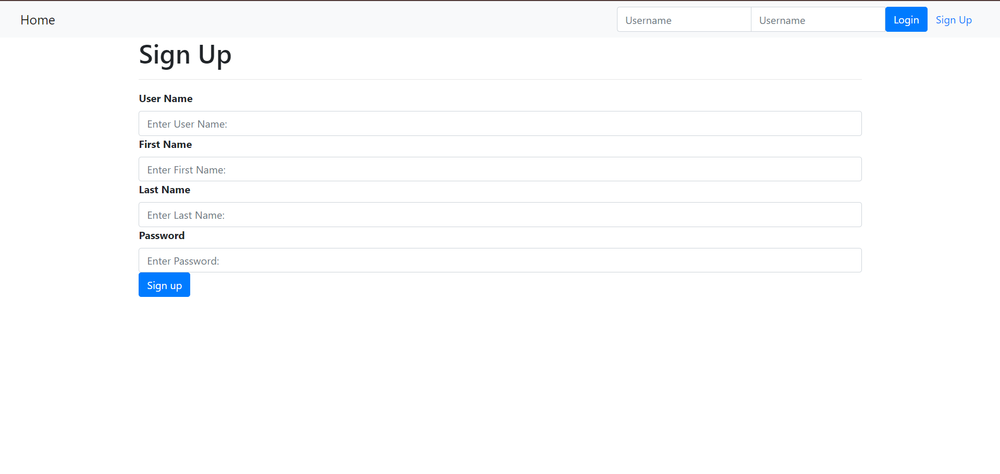

# Online Course Application

This repository contains the implementation of an Online Course Application developed using Django. It demonstrates a full-stack approach to building web applications, showcasing server-side logic, database integration, and front-end development. The application includes a newly implemented feature for course assessments, providing users with the ability to participate in exams and view results.

---

## Table of Contents
- [Overview](#overview)
- [Entity-Relationship Diagram](#entity-relationship-diagram)
- [Technologies Used](#technologies-used)
- [Features](#features)
- [Course Certificate](#course-certificate)

---

## Overview
The Online Course Application is designed to manage and deliver online courses, including exams and assessments. This feature enables users to:
1. View course details.
2. Attempt exams linked to courses.
3. Submit answers and view results.

---

## Entity-Relationship Diagram

The ER diagram for the application illustrates the relationships between Courses, Exams, Questions, and Submissions. 

---

## Technologies Used
- **Django**: Framework for back-end development.
- **SQLite**: Database for storing application data.
- **HTML/CSS**: Front-end structure and styling.
- **Bootstrap**: Responsive design.
- **GitHub**: Version control and project hosting.

---

## Features

1. **Index Page**: Displays courses, enroll, login, sign up.
   
   

3. **Login Page**: Allows users to log in.
   
   

5. **Logged-In Page**:
   
   

6. **Registration Page**:
   
   

7. **Course Details View**: Displays course lessons and associated exam.
   
   

8. **Course Details with Exam**: Attempting the exam.
    
   

9. **Exam Results**: Displays user scores and answers.
    
   

10. **Admin Site**: For managing ORM models.
    
   

---

## Course Certificate
You can view the course certificate [here](Django_Application_Development_with_SQL_&_Databases.pdf).
